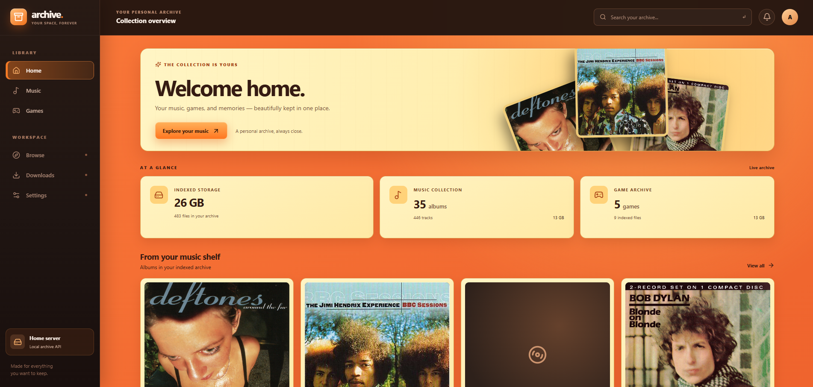

# Home Archive

<!--  -->
<p align="center">
  
</p>


Home Archive indexes media in a local SQLite database. Its API serves metadata
and indexed files, and the Vite client provides a browser interface. The API
can run independently of the client.

## Set up a fresh clone

Install Git and Node.js 22 or newer with npm. On Ubuntu, install the native
build tools first: `better-sqlite3` may need to compile during `npm ci`.

```sh
sudo apt update
sudo apt install -y build-essential python3
```

Clone the repository on the machine that will run the archive, then install
dependencies from the lockfile:

```sh
git clone <repository-url> home-archive
cd home-archive
npm ci
```

If an earlier `npm ci` failed with `gyp ERR! stack Error: not found: make`, run
the Ubuntu prerequisite commands above and retry `npm ci` in the repository.

Media in `archive/`, the SQLite database in `data/`, and `.env` are ignored by
Git, so a clone does not contain them. Copy or mount your media separately. Set
`ARCHIVE_ROOT` to the directory containing the `Music`, `Games`, `Pictures`, and
`Videos` folders. Folder names must match that capitalization on case-sensitive
file systems. If `ARCHIVE_ROOT` is unset, the indexer uses `/Archive`, a default
path that may need changing for your system. The process must be able to read
the media and write to the database directory. Create a fresh index on each
machine because file records contain absolute paths.

## Environment variables

Set variables in the shell before running an npm command, or configure them in
the environment of the service that starts the application. For example, from
the repository root, use the syntax for your shell:

**POSIX shell (Linux or macOS):**

```sh
export ARCHIVE_ROOT="$(pwd)/archive"
```

**PowerShell (Windows, Linux, or macOS):**

```powershell
$env:ARCHIVE_ROOT = (Join-Path (Get-Location) 'archive')
```

These examples assume the media is in the repository's `archive/` directory;
use the path to your media if it is elsewhere. The other variables are optional.
Relative paths are resolved from the directory where the command is run, so
use absolute paths for a service. Shell variables apply to that shell session
and the commands it starts.

| Variable | Default | Purpose |
| --- | --- | --- |
| `ARCHIVE_ROOT` | `/Archive` | Media root scanned by `index:files`; contains `Music`, `Games`, `Pictures`, and `Videos`. |
| `ARCHIVE_DB` | `data/archive.db` in the repository | SQLite index used by the API and all three indexers. Its parent directory is created if needed. |
| `HOST` | `127.0.0.1` | Address where the API listens when started with `npm start` or by `npm run dev` / `npm run preview`. Use `0.0.0.0` only when the API itself should accept network connections. |
| `PORT` | `3000` | API port, also used by the Vite `/api` proxy. Must be an integer from 1 to 65535. |
| `IGDB_CLIENT_ID` | unset | Optional Twitch developer application client ID for game metadata lookup during indexing. |
| `IGDB_CLIENT_SECRET` | unset | Optional matching client secret. Both IGDB credentials must be set for lookup; neither is needed to serve the API. |
| `IGDB_REFRESH` | unset | Set to `1` for an indexing run to look up games that already have IGDB matches again. |
| `GAME_EXTRA_EXTENSIONS` | unset | Optional comma- or space-separated extra game file suffixes for `index:games`, such as `.rom,.foo`. Leading dots and letter case are optional. |

An `.env` file can hold local values and is ignored by Git, but the npm scripts
do **not** load it automatically. Load its values using a method supported by
your shell or process manager, or set the variables directly before running
commands. Keep credentials out of version control.

## Build the index

From the repository root, after the media is available and `ARCHIVE_ROOT` is
set if needed, run:

```sh
npm run index
```

This runs `index:files`, then `index:music`, then `index:games`. The file indexer
scans the four category folders and stores absolute file paths in SQLite. The
music and game indexers read those file records to add metadata. Run the full
command again after adding or changing files. To run a stage separately, use
`npm run index:files`, `npm run index:music`, or `npm run index:games`; run the
file stage first when the archive contents have changed.

The file indexer leaves records for deleted files in place by default. After
confirming that the media is available and readable, remove stale records with:

```sh
npm run index:files -- --prune
npm run index:music
npm run index:games
```

Missing category folders are reported and skipped. On a new machine, use a new
database so old absolute file paths do not remain in the index.

The game indexer accepts any `Games/<platform>/` folder name. It recognizes
common disc images (`.iso`, `.chd`, `.cso`, `.zso`, `.ciso`, `.gcm`, `.rvz`, `.wbfs`,
`.cdi`, `.pbp`) and console formats including `.nes`, `.sfc`, `.smc`, `.n64`,
`.z64`, `.gb`, `.gbc`, `.gba`, `.nds`, `.3ds`, `.sms`, `.gg`, `.md`, `.gen`, `.xci`,
and `.nsp`. Other supported suffixes are listed in `src/indexers/gameIndexer.js`.
For an uncommon format, set `GAME_EXTRA_EXTENSIONS` before running
`npm run index:games`; the file must first be in the generic file index.
Ambiguous files such as `.bin`, `.cue`, `.gdi`, `.m3u`, and archives are not
classified as games by default. BIOS files remain in the generic file index.

For optional IGDB metadata and cover art, set `IGDB_CLIENT_ID` and
`IGDB_CLIENT_SECRET` from a Twitch developer application before running
`npm run index:games`. The indexer stores matched metadata locally; the API
needs no IGDB credentials at runtime. IGDB matching requires both the title and
platform to agree, so use the platform's IGDB name for its folder when possible.
Unmatched games keep their filename title and nullable metadata. A
`<game name>.game.json` file beside a game can override `title`, `platform`,
`release_year`, and `genre`; a `.jpg`, `.jpeg`, `.png`, or `.webp` file with the
same name stem beside the game is used as local cover art.

## Start the API and client

For development, run `npm run dev` from the repository root. It uses an API
already available at `http://127.0.0.1:3000/api/v1/health`, or starts one, then
starts Vite on port 5173 and proxies `/api` to the local API. The current Vite
development configuration listens on `0.0.0.0`, so another device on the same
network can open `http://<server-lan-ip>:5173` if the firewall permits it. Keep
the command running while using the client.

To start only the API, run `npm start`. It listens at
`http://127.0.0.1:3000/api/v1` by default; this command does not serve the
client. To build and inspect the client, run:

```sh
npm run build
npm run preview
```

The build goes into `client/dist`. Preview starts or reuses the API and serves
the built client, with `/api` proxied to the local API. Preview binds to
`127.0.0.1` by default on Vite's default preview port, 4173, so it is available
on the machine running it. Music and games pages use indexed data.

## API

All endpoints are under /api/v1 and currently support GET and HEAD.

| Endpoint | Purpose |
| --- | --- |
| /health | Check server and database availability |
| /library/summary | File totals by category, music totals, and game totals |
| /files | Search and list indexed files |
| /files/:id | File metadata |
| /files/:id/content | Inline file content, including byte ranges |
| /files/:id/download | File content as an attachment |
| /music/artists | Search and list artists |
| /music/artists/:id | Artist details |
| /music/albums | Search and list albums |
| /music/albums/:id | Album details |
| /music/albums/:id/tracks | Ordered album tracks |
| /music/albums/:id/artwork | Cover file or embedded image |
| /music/albums/:id/download | ZIP of the indexed album folder |
| /music/tracks | Search and list tracks |
| /music/tracks/:id | Track details |
| /games | Search and list indexed games |
| /games/:id | Game details, metadata, artwork URL, and download URL |

Lists accept limit (default 30, maximum 100) and offset. File filters are q,
category, extension, and path (a relative path prefix). Album filters are q,
artist_id, year, and genre. Track filters also accept album_id. Artist lists
accept q.
Game filters are q, platform, genre, and year.

List responses contain data and pagination (limit, offset, total). Detail
responses contain data. Sizes are bytes, durations are milliseconds, and missing
music tags are null. File paths in JSON are relative to their archive category;
the API never accepts an arbitrary filesystem path for file delivery. Album
downloads stream a ZIP containing the indexed album folder, including sidecar
files such as cover images when present.
